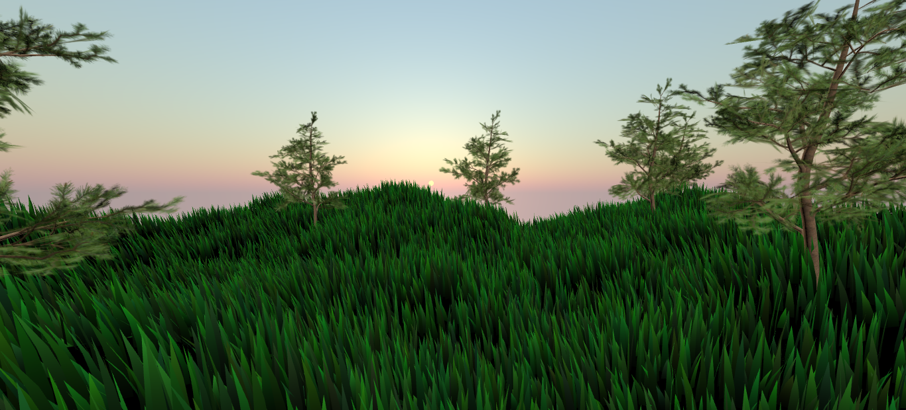

<H1>The Garden of Eden</H1>

The aim of this project was to create an immersive game where users could step into and interact with a Biblically accurate representation of the Garden of Eden.

For this project Typescript, Three.js, Vite, Bun, Vitest and AI was used

To use: 

<ul>
<li>Clone repo: https://github.com/DavidCodila/bible-game.git </li>
<li>cd into repo directory</li>
<li>bun install</li>
<li>bun dev</li>
<li>go to http://localhost:5173/</li>
</ul>

Soli Deo Gloria
